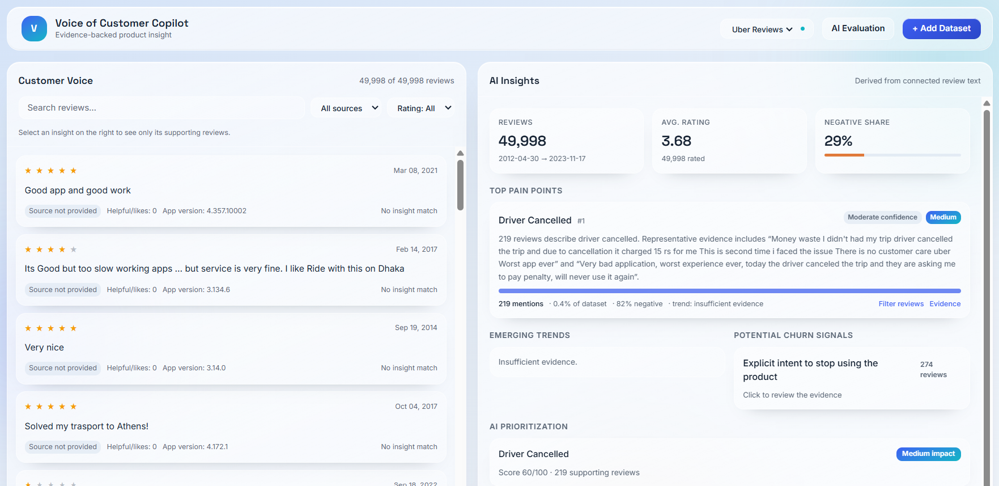
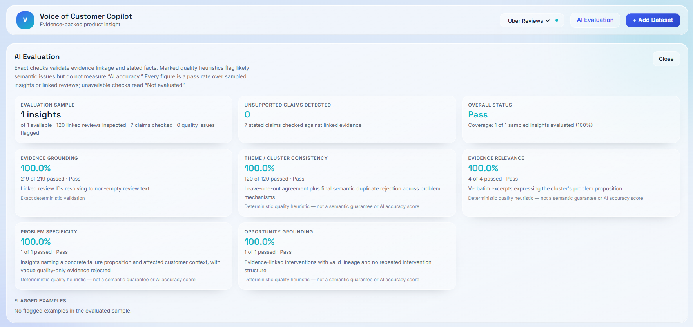

# Voice of Customer Copilot

AI-powered product research and decision-support tool that helps Product Managers turn large volumes of unstructured customer feedback into evidence-backed product insights.

## 🚀 Live Demo

[Try Voice of Customer Copilot](https://voice-of-customer-copilot.lovable.app)

The live demo includes **49,998 real Uber app customer reviews** as the default dataset.

The product is dataset-agnostic and supports uploading additional customer-feedback datasets.

---

## 🎯 Problem

Product Managers often have access to thousands of customer reviews and other feedback, but turning that unstructured feedback into reliable product insights is difficult.

Simply asking an LLM to summarize reviews can produce:

- Vague problem statements
- Duplicate themes
- Unsupported conclusions
- Poor prioritization
- Recommendations that are not grounded in customer evidence

Voice of Customer Copilot is designed to help PMs move from:

**Customer Feedback → Evidence → Problems → Patterns → Priorities → Product Opportunities**

---

## 💡 What It Does

Voice of Customer Copilot helps Product Managers:

- Identify recurring customer pain points
- Cluster related feedback into problem themes
- Trace insights back to supporting customer reviews
- Detect emerging trends
- Surface potential churn signals
- Prioritize problems using evidence-based signals
- Generate potential product opportunities
- Evaluate the quality and evidence-grounding of AI-generated insights

---

## 🔍 Evidence-First Product Design

A core design principle is **traceability**.

Instead of showing a conclusion such as:

> "Customers are frustrated with cancellations."

the product allows a PM to select the insight and inspect the underlying customer reviews supporting it.

This creates a feedback loop between:

**AI Insight ↔ Customer Evidence**

The goal is not to replace PM judgment, but to make AI-generated findings easier to investigate, verify, and challenge.

---

## 🖥️ Product Workflow

```text
Customer Reviews
       ↓
Feedback Analysis
       ↓
Pain Point Detection
       ↓
Problem Clustering
       ↓
Evidence Inspection
       ↓
Trend & Churn Signals
       ↓
Prioritization
       ↓
Potential Product Opportunities
       ↓
PM Investigation & Decision
```

---

## 📊 Key Product Areas

### Customer Voice

A searchable and filterable feed of the underlying customer reviews.

PMs can inspect the actual feedback behind the analysis rather than relying only on AI-generated summaries.

### AI Insights

The dashboard surfaces:

- Top Pain Points
- Emerging Trends
- Potential Churn Signals
- AI-assisted Prioritization
- Potential Product Opportunities

### Evidence Traceability

Each surfaced insight is connected to supporting customer reviews.

Selecting an insight filters the customer-feedback panel to the reviews supporting that insight.

This makes the output easier for PMs to verify and challenge.

### AI Evaluation

The product includes deterministic checks for:

- Evidence grounding
- Theme / cluster consistency
- Evidence relevance
- Problem specificity
- Opportunity grounding

These checks are intentionally separated from claims of overall **"AI accuracy."**

---

## 🎥 Screenshots

### Main Dashboard

The main dashboard connects customer feedback with AI-generated product insights.



### AI Evaluation

The evaluation layer checks whether generated insights remain grounded in the underlying customer evidence.



---

## 🧪 Dataset

The default demo uses **49,998 real Uber app customer reviews**.

The dataset contains review-level information including:

- Review text
- Rating
- Date
- Likes
- App version

The application does not depend on Uber-specific logic. Additional customer-feedback datasets can be uploaded through the application.

---

## 🧠 AI Product Considerations

The project was designed around several important AI product principles.

### Evidence Grounding

AI-generated insights should remain connected to the customer feedback that supports them.

### Conservative Claims

The system distinguishes between:

- Observed evidence
- Potential signals
- Hypotheses requiring further validation

For example, the product uses **"Potential Churn Signals"** rather than claiming to predict customer churn.

### Failure Modes

The system considers failure modes such as:

- Duplicate or overlapping pain points
- Vague problem clusters
- Unsupported trends
- Insufficient evidence
- Repetitive or weak product opportunities

### Human-in-the-Loop Decision Making

The system is designed to support PM investigation rather than automatically determine what should be built.

---

## 📈 Prioritization

Pain points are prioritized using evidence-based signals such as:

- Frequency
- Negative feedback
- Trend signals
- Potential customer impact
- Available supporting evidence

The resulting priority is treated as a decision-support signal rather than an automatic roadmap decision.

---

## 🛠️ Tech Stack

- React
- TypeScript
- Vite
- Tailwind CSS
- Data-driven customer-feedback analysis
- AI-assisted development with Lovable
- GitHub for source control

---

## ⚙️ Product Architecture

```text
Customer Feedback Dataset
          ↓
Data Ingestion & Normalization
          ↓
Problem Detection & Clustering
          ↓
Evidence Validation
          ↓
 ┌────────┼───────────┐
 ↓        ↓           ↓
Trends   Churn     Prioritization
 ↓        ↓           ↓
 └────────┼───────────┘
          ↓
Potential Product Opportunities
          ↓
PM Investigation & Decision
```
